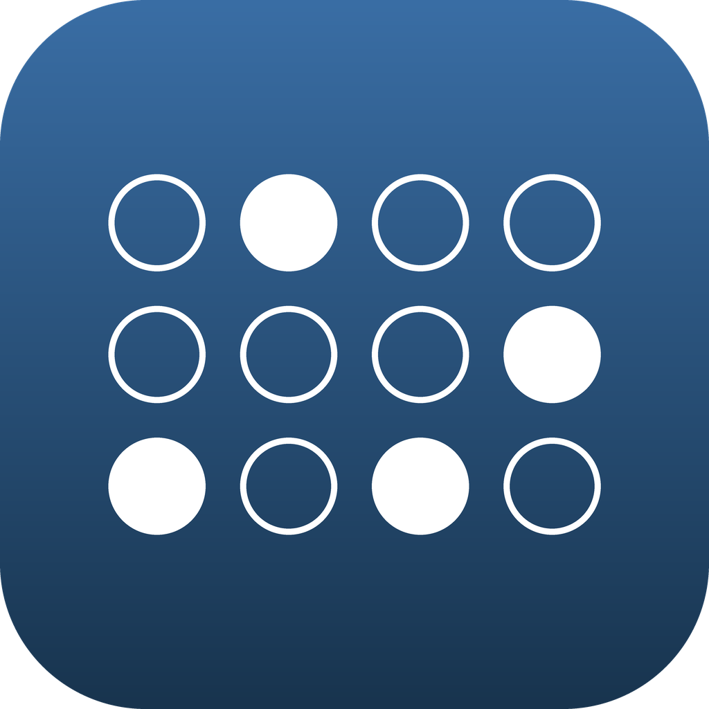
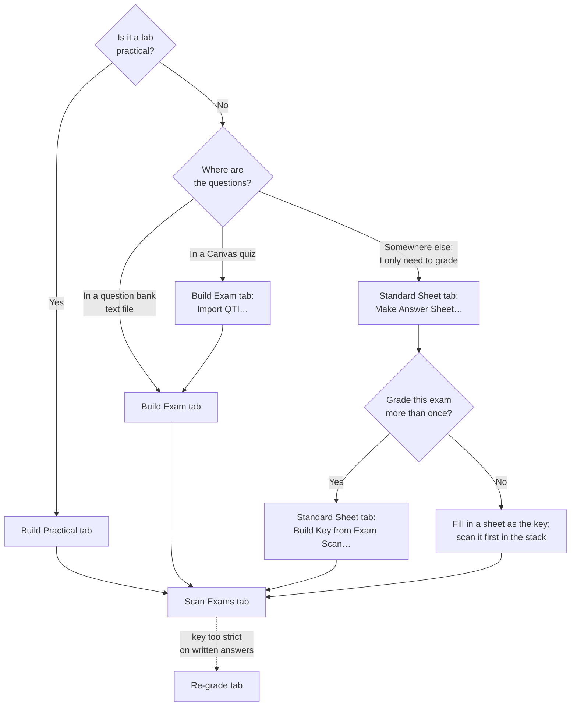

# pyExamKit

A desktop app for building bubble-sheet exams from question banks, then scanning and grading them. Both halves — building and grading — share one file format and one download; there is nothing else to install.

Written by Brandon E. Jackson, Ph.D. Licensed under [GPLv3](LICENSE).

---

## What it does

The app opens to one window with five tabs, sharing a single log at the bottom. Each tab's action button sits at the bottom of the tab, above the log, and **Help**, at the right end of the row of tabs, opens the guide page for the tab you are on.

**Build Exam** turns one or more plain-text question banks into a printable exam — multiple choice, multiple answer, true/false, short answer, multiple dropdown, ordering, and matching — in up to six scrambled versions, with an answer key CSV the scanner grades against. It can also import a Canvas QTI export, so a quiz that already exists in Canvas becomes a paper exam without being retyped.

**Build Practical** turns one plain-text source file into everything a lab practical needs: an answer sheet for each pairing of questions, station placards, a setup guide, and an instructor key. The same file is the key that grades every form's sheets in one scan.

**Scan Exams** reads a stack of completed answer sheets, grades them against the key, and writes out a results spreadsheet, a per-question breakdown, a Canvas-ready upload file, and a marked copy of every student's sheet.

**Re-grade** re-runs the open-ended grading against transcriptions already on disk, so a key that turns out to have been too strict can be loosened without rescanning anything.

**Standard Sheet** prints a blank answer sheet for an exam made elsewhere, and produces that same key CSV from a scanned answer sheet, either by reading the bubbles you filled in by hand or by letting you mark where the handwritten answers sit on the page.

## Where to start

Which tab you start on depends on what you already have. Every path ends on **Scan Exams**.

**A lab practical.** Write the practical as one source file ([Lab practicals](docs/lab-practicals.md)) and build it on the **Build Practical** tab, which writes the form sheets, placards, setup guide, and instructor key. On **Scan Exams**, choose the source file itself as the key. A practical graded before, with a key CSV for each form, can be converted to a source file with the tool that guide describes.

**An exam in a question bank.** Write or collect the questions in the [question bank format](docs/question-bank-format.md) and build on the **Build Exam** tab, which writes the exam, its answer sheet, and a key CSV for each version ([Building an exam](docs/building-exams.md)). On **Scan Exams**, choose that key.

**An exam in Canvas.** Export the quiz from Canvas as QTI, and on the **Build Exam** tab click **Import QTI…** to turn it into a question bank ([Importing a Canvas quiz](docs/importing-canvas-quizzes.md)). From there it is the path above.

**An exam made somewhere else**, when you only need the grading. Print a blank sheet from **Make Answer Sheet…** on the **Standard Sheet** tab ([Answer sheets](docs/answer-sheets.md)). If you will grade the exam again, fill in a sheet as the key, scan it, and turn it into a key file with **Build Key from Exam Scan…** on the same tab ([Building a key](docs/building-keys.md)). For a one-time grading, skip the key file: put your filled-in key sheet first in the stack and scan without one.

**After grading**, if the key turns out to have been too strict on written answers, the **Re-grade** tab loosens it and re-grades without rescanning ([Open-ended questions](docs/open-ended-questions.md#re-grading-afterward)).

## Documentation

1. [Installation](docs/installation.md) — download a packaged app, or run from source
2. [Question bank format](docs/question-bank-format.md) — how to write the plain-text file the exam is built from
3. [Building an exam](docs/building-exams.md) — the Build Exam tab: pools, versions, shuffling, and what it writes out
4. [Importing a Canvas quiz](docs/importing-canvas-quizzes.md) — turning a QTI export into a question bank
5. [Answer sheets](docs/answer-sheets.md) — the printable sheets, and how far you can modify them
6. [Building a key](docs/building-keys.md) — the Standard Sheet tab, plus the key CSV format
7. [Scanning and grading](docs/scanning-and-grading.md) — the Scan Exams tab and how each score is calculated
8. [Class rosters](docs/roster.md) — putting names on results by ID, from a Canvas export or your own spreadsheet
9. [Open-ended questions](docs/open-ended-questions.md) — handwriting transcription, on-screen grading, and re-grading
10. [Outputs](docs/outputs.md) — every file the app writes and what to do with it
11. [Lab practicals](docs/lab-practicals.md) — writing a practical's source file, building its sheets and placards, and grading every form in one stack
12. [FAQ and troubleshooting](docs/faq.md)

Design notes and implementation history live in [docs/dev/](docs/dev/). They document why parts of the app are built the way they are, and are aimed at anyone modifying the code rather than at anyone using it.

## Related

The question bank format is shared with [qtiConverter](https://github.com/backyardbiomech/qtiConverter), which converts the same plain-text file into a Canvas QTI package. One bank file can feed both a paper exam and a Canvas quiz.
